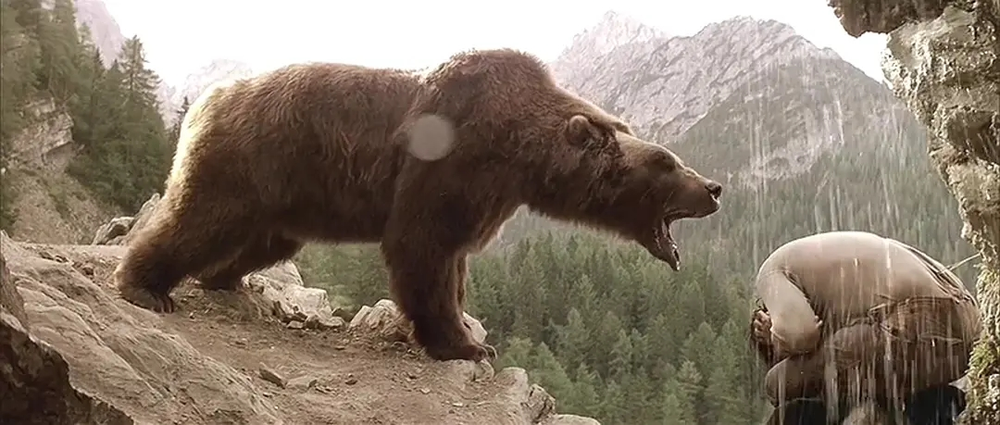

> The greatest thrill is not in killing, but in letting live!

<!-- more -->

昨日看了一部治愈得电影,让我感到思绪良多。也让自己对于自己的生活产生了一些思考。我想通过对电影的感觉来触达我对生活的领悟。让自己不要处于一种迷失的状态，能通过一些东西来斧正自己的方向。

  对于情感的抒发，这一点感觉无论是在动物还是人身上都有很强烈的表现。这部电影让我感觉，其实动物和人也是一样的（当然人也属于动物的一种），对于自己父母都有者很强烈的思恋。小时候的倔强和顽皮都是那么相似。我们
对于自己的情感，可能在随着自己的长大，而不愿意去放开自我，让自己存在在一个封闭的世界中。人有时候其实挺想以前小时候无忧无虑的，小时候又常常想快点长大，想让自己能够更加自由，（让自己的财富自由，不用被家里所固定住），但是当自己长大了才发现，其实自己所要面临的东西，所承受的压力要多得多。生活或许就像大家所说的那样，需要砥砺前行。人，是一种不能被太被放纵的动物，脱离了自己的缰绳，那样就会让自己感到无所适从，感到彷徨。无论是人亦或是动物，我们在生活中一样存在的诸多问题去解决，在面对的时候，能够让自己更加的大胆，坚守的前行。

看这部电影的时候，真的感觉大自然就等同于现在的社会，有时候站在高处，俯瞰山丘，觉得这景色是如此美丽，让人神往。在这里充满着美丽的事物，让自己想去探寻。但是着隐藏的危机也着实让人感到恐惧，没有任何人去通知你，也许就在你身后，正有人盯着你。社会上的美好总是会在“夜幕”降临下来之后的丑陋显现出来。或许并不要太执着于去探讨这个社会如何可怕，或许应该去追寻更加美好的事物，让自己的眼里时刻充满着生机，不要去思索太多，生活本就不易，何苦呢？哈哈，人抑或动物，只要努力前行，终将能看到那白雪之后的绿芽。

最后想说的一句话，可能是电影中最为精彩的一句话“The greatest thrill is not in killing, but in letting live!” - 最为让人激动的并不是杀戮，而是去放生。人所最求的并不是去行乐，而是要通过事情中的本质去让自己明白，人和动物，亦或是你的朋友，你需要的或许并不是表面的东西，而是一些你尚未发现的内在的东西，这些会让你的整个人生得到升华。我想说的是，永远不要被自己的表面而感到假高兴，而是要让自己的内心得到洗礼（当然我希望的是人之初，性本善);