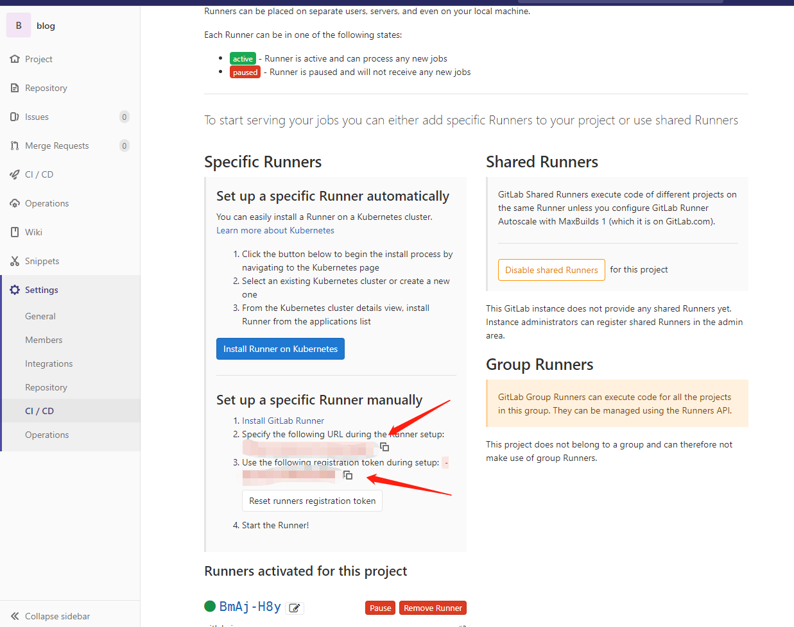

> 自动化一直是自己比较想去花时间来整理的一个东西，果不其然，确实也在这上面花了时间。可谓是痛苦和煎熬


### gitlab runner 安装

添加安装库
```sh
 # For Debian/Ubuntu/Mint
 curl -L https://packages.gitlab.com/install/repositories/runner/gitlab-runner/script.deb.sh | sudo bash

 # For RHEL/CentOS/Fedora
 curl -L https://packages.gitlab.com/install/repositories/runner/gitlab-runner/script.rpm.sh | sudo bash
 ```
安装
```sh
 # For RHEL/CentOS/Fedora
 sudo yum install gitlab-ci-multi-runner
```

### gitlab-runner 注册
> 在gitlab项目中找到自己的token和url

 

使用命令注册gitlab-runner
```sh
gitlab-runner register
```

1. 输入gitlab的服务URL，这个使用的是图里的url

2. 输入gitlab-ci的Toekn，获取方式参考上图

3. 关于集成服务中对于这个runner的描述

4. 给这个gitlab-runner输入一个标记，这个tag非常重要，在后续的使用过程中需要使用这个tag来指定gitlab-runner

5. 是否运行在没有tag的build上面。在配置gitlab-ci的时候，会有很多job，每个job可以通过tags属性来选择runner。这里为true表示如果job没有配置tags，也执行
是否锁定runner到当前项目

6. 选择执行器，gitlab-runner实现了很多执行器，可用在不同场景中运行构建，详情可见GitLab Runner Executors，这里选用**Shell**模式(这个地方很重要，如果选docker,可能之后的操作就会出现docker in docker， 同事，docker executor 是一种job执行完，容器就会销毁的操作)

到了这一步，gitlab已经安成功, 同时可以在 /etc/gitlab-runner/config.toml 查看配置文件

### 使用

在之际的项目中定义.gitlab-ci文件，这个是ci的执行文件，gitlab会自动去检测，并执行里面的命令

简单版： 单独执行脚本文件
```sh
stages: 
  - build
build:
  stage: build
  tags:
    - build
  script:
    - node -v
    - cd /usr/local/project/blog
    - yarn build
```

这里可能会出现读写权限不足的情况， 这是因为当前执行操作的用户是gitlab-runner导致的，可以修改
配置文件 /etc/passwd 

复杂版：构建镜像并上传到cloud.docker

这种需要到cloud.docker注册自己的账号，然后把构建好的镜像上传到云上，每次用的时候，拉去就可以了
```sh
image: docker:stable

services:
  - docker:dind

variables:
 REGISTRY_IMAGE_TAG: 'yaobodocker/blog:v2'
 DOCKER_TLS_CERTDIR: ''

before_script:
  - docker login -u xxx-p xxx
build:
  stage: build
  script:
     # 构建新的镜像
    - docker build -t $REGISTRY_IMAGE_TAG .
      docker push $REGISTRY_IMAGE_TAG
    # 删除已经在运行的容器
  only:
    - master
  tags:
 ```

 Dockerfile
 ```sh
FROM node:latest
COPY . /blog/
WORKDIR /blog/
RUN npm install && npm run build

FROM nginx:latest # 多段打包

COPY --from=0 /blog/docs-dist /usr/share/nginx/html/

EXPOSE 80
```

可能出现的问题：

1. DOCKER push失败:denied: requested access to the resource is denied
将本地镜像增加tag信息
```sh
docker tag blog yaobodocker/blog:v2
docker push yaobodocker/blog:v2
```