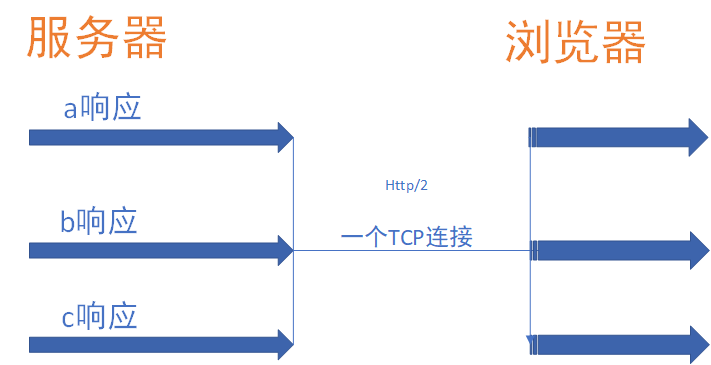

## HTTP 常见的状态码

状态码主要包裹 5 种不同的类型 1**（消息）、2**（成功）、3**（重定向）、4**（请求错误）、5\*\*（服务器错误）

| HTTP 状态码 |                          描述                          |
| :---------- | :----------------------------------------------------: |
| 100         |   继续。继续响应剩余部分，进行提交，如已完成，请忽略   |
| 200         |                     服务器请求成功                     |
| 301         |          永久移动。请求资源已永久移动至新位置          |
| 302         |           临时移动。请求资源临时移动至新位置           |
| 304         | 未修改。请求资源对比上次未被修改，响应中不包含资源内容 |
| 401         |                  未授权。要求验证身份                  |
| 403         |                    禁止。请求被拒绝                    |
| 404         |          未找到。服务器未找到请求所需要的资源          |
| 500         |      服务器内部错误。服务器遇到错误，无法完成请求      |
| 503         |           服务不可用。临时服务过载，无法请求           |

## 常用的 HTTP 首部字段

HTTP 首部字段由字段名和值两部分组成，常见的首部字段如下。
|字段名|描述|
| :---------- | :----------------------------------------------------: |
|User-Agent|HTTP 客户端程序的信息|
|Last-Modified| 资源的最后修改日期|
|Content-Length| 实体主体的大小，单位为字节|
|Content-Encoding|实体主体适用的编码方式，如gzip、compress、deflate、identify等|
|Content-Type|实体主体的媒体类型， 如image/png, application/x-javascript、text/html等|
|Expires| 实体主体过期的日期和时间|
|Set-Cookie|开始状态管理所使用的Cookie信息|
|Cooke|服务端接收的Cookie信息|
|Cache-Control|控制缓存的行为，如public、private、no-cache等|
|ETag| 资源匹配信息|
|Vary|代理服务器缓存的管理信息|
|Server|HTTP服务器安装信息|

### 多路复用
在HTTP/1.0中。如果需要并发多个请求，则必须创建多个TCP连接，并且连接的数量有限制，为6个。

HTTP/1.1中，引入流水线（Pipelining)技术。即FIFO(first input first out), 当前请求依赖上一个请求，容易造成请求头阻塞

HTTP/2 重新定义了底层的HTTP语义映射，允许在同一个连接上使用请求和响应双向数据流。

