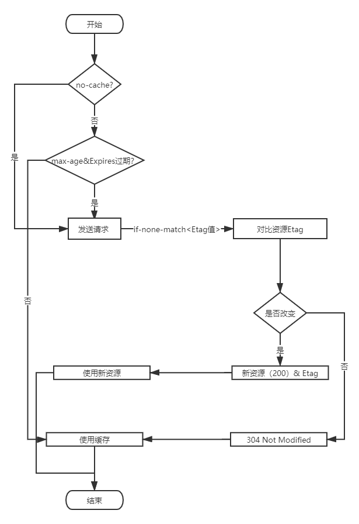

合理利用缓存是我们对自己项目优化的重要手段。我们主要利用的有两种。

- 本地存储： LocalStorage、SessionStorage、cookie
- http 缓存：强缓存和协商缓存

这里主要来讲解下 Http 的缓存策略。

<!--more-->

## Http 的缓存策略

>

其中 http 的缓存策略又可以分为强制缓存和协商缓存，两种缓存机制都会将资源缓存到本地。

- **强制缓存** 策略是根据过期的时间来决定使用本地缓存还是请求资源。
- **协商缓存** 每次都会发出请求，经过服务器进行对比后决定采用本地缓存还是新资源。

### Expires

Expires 和 max-age 都是强制缓存的关键信息

- Expires

是 Http1.0 加入的特性。通过指定一个明确的时间来作为缓存的过期时间。
优点：可以在缓存过期时间内减少了 http 的请求，减少了服务器负载和网络资源的消耗

```sh
 Expires: Wed, 23 Aug 2020 20:00:00 GME
```

上述信息表示缓存过期时间为 2020/08/23 20:00:00

缺点：它指的时间是以服务器为准的时间，但是客户端进行判断是用本地时间与该时间进行对比。

举个例子, 如果服务器时间为 2020/08/23 20:00:00， 客户端为 2020/08/23 21:00:00，那么这样就会造成缓存数据不准确，服务器的数据已经失效了，但是客户端这里实际还是用了缓存数据。

### Cache-control

针对这种情况， HTTP1.1 新增了**Cache-control**首部信息，Cache-control 信息有以下几种

1. **no-cache** 和 **no-store**:

- no-chace: 并非禁止缓存，而是先于服务器确认返回的响应是否发生变化，如果资源未发生变化，则可以使用缓存副本从而避免下载。（设置成这样就不会判断 max-age, Expires 过期时间，从而每次请求资源都会经过服务器对比 ）
- **no-store**: 是真正意义的禁止缓存，禁止浏览器以及所有的中间缓存存储，每次用户都会向服务器请求，并下载完整的响应。

2. **public** 和 **private**
* public: 表示此响应可以被浏览器以及中间缓存器无限期缓存，此信息不常用，常规方案是使用max-age来指定精确的缓存时间。
* private: 表示此响应可以被用户浏览器缓存，但是不允许任何中间缓存器对其缓存。例如，用户的浏览器可以缓存包含用户私人信息的html网页，但CDN不允许

3. **max-age**: 指定请求时刻开始计算，此响应的缓存副本的有效的最长时间（单位：秒），例如 ”max-age: 3600",表示浏览器在接下来的一小时使用此响应的本地缓存。max-age指的是时间跨度，所以相比Expires可以更加精确的控制缓存，且优先级比Expires高。

### Etag 和 If-none-match

* Etag 是服务器为资源分配字符串形式唯一性标识，作为响应的首部信息返回给浏览器。浏览器在**Cache-control**指定**no-cache**或者**max-age**和**Expire**均过期之后，
将Etag值通过**If-none-match**作为请求的首部信息发送给服务器。服务器接收到请求之后，对比所请求的资源的Etag值是否发生变化，如果未改变将返回304 Not Modified, 并且根据既定的缓存策略分配新的**Cache-control**信息，如果资源发生改变，则会返回最新的资源以及重新分配ETag值。

* [引申](https://www.cnblogs.com/happy4java/p/11206015.html)


### 总结

* 流程图



协商缓存并非是一种比强制缓存“低级”的策略，对于一些特殊的应用场景，协商缓存甚至更优于强制缓存。

对于一些非服务端渲染的项目，由于它是所有静态资源的引用者，这时候可能就得保证每次请求都是最新得内容。
