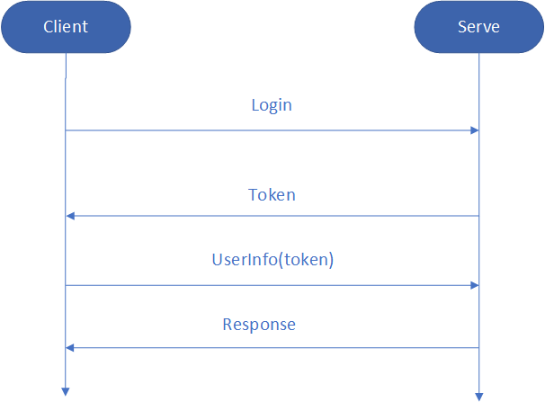

常用鉴别用户权限得方式有两种，一种是广泛使用的 **Cookie-Based Authentication(基于 cookie 的认证模式)**, 另一种是**Token-Based Authentication(基于 Token 的认证模式)**。

cookie 方式，容易被人劫持，相对来说不安全。一般桌面应用程序，可以适用桌面程序。

Token 方式最大的优点就是采用了无状态机制，在此基础上，可以实现天然的跨域支持、前后端分离等，同时降低了服务端开发和维护的成本。
Token 的缺点在于服务器每次都需要对 token 进行校验，这一步骤会对服务器产生运算压力。另一方面，无状态 API 缺乏对用户流程或异常的控制，为了避免出现一些例如回放攻击的异常情况，应该设置较短的过期时间，且需要对密钥进行严格的保护。


基于Token认证模式交互如图：



用 node 实现一个简单的,token 权限控制

```js
const koa = require("koa");
const bodyParser = require("koa-bodyparser")();
const router = require("koa-router")();
const { sign } = require("jsonwebtoken");
const admin = require("./admin/index");
const app = new koa();
const secret = "yaobo";
const jwt = require("koa-jwt")({ secret }); // 用密码构造jwt

router
  .post("/api/login", async (ctx, next) => {
    const user = ctx.request.body;
    console.log("name:", user, user.username);
    if (user && user.username) {
      let { username } = user;
      // 生成token, secret作为密钥需自己来设置， expiresln 为失效时间，不要设置太久
      const token = sign({ username }, secret, { expiresIn: "1h" });
      ctx.body = {
        message: "Get Token Success",
        code: 1,
        token
      };
    } else {
      ctx.body = {
        message: "Params Error",
        code: "-1"
      };
    }
  })
  .get("/api/userInfo", jwt, async ctx => {
    /* 1. koa-jwt会将校验后的用户信息放在上下文的State信息中
       所得token 通过放置于请求头中 Authorization 字段中，格式为 (Bearer token)
    */
    ctx.body = { username: ctx.state.user.username };
  })
  .get("./api/adminInfo", jwt, admin, async ctx => {
    ctx.body = { username: ctx.state.user.username };
  });
app
  .use(bodyParser)
  .use(router.routes())
  .use(router.allowedMethods());

app.listen(3000, () => {
  console.log("运行成功");
});
```
