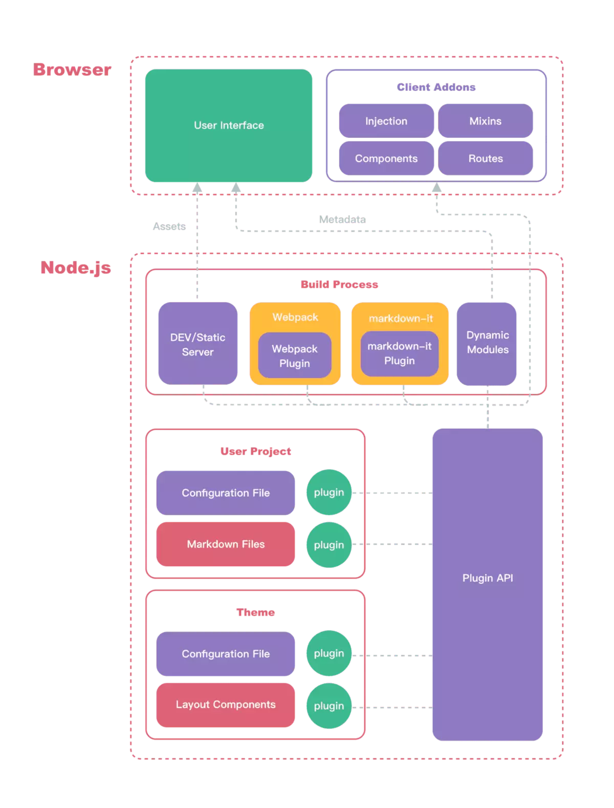

之前尝试过各种主题博客，一直是 hexo; 但是用了一段时间的 vuepress，发现真的相当适合来写自己的博客；主要配合 vue 的使用，能搞很好的实现自定义主题的书写。
<!-- more -->

## vuepress 结构

- docs => .vuepress => config.js

这个是 vuepress 的配置文件，可以通过里面的配置项 theme 来配置自己的自定义主题配置。

```js
module.exports = {
  title: '', // 标题
  head: [], // 相应的头部信息
  description: '', // 描述信息
  port: 80, // 端口
  theme: path.resolve(__dirname, '../../lib'), // 用来放置个人主题的位置
  ...
```

## 自定义主题的基本架构


通过架构可以看到后端主要也是以node为基础。而前端自然不必说了就是用我们所熟悉的Vue;

主要来分析服务端这部分：
 这部分主要暴露了webpack, makrdown-it-plugin, 主要是build process这一部分。

 vuepress内部提供了一套默认的主题。

 最核心的是Api plugin，这部分是我们能够实现vuepress内部参数调用的重用组成部分，即 插件。

### vuepress 内部的插件
1. enhanceAppFiles: 全局增强。

    它通过使用enhanceAppFiles这个文件来增强来你的全局应用。vuepress通过这个可以确定你增强的文件所在。简单的来说，你可以通过它来配置一些全局的变量。
有点类似app.js。放置一些全局的引用，变量。通过这个能把文件夹中的vue都注册好。

2. clientDynamicModules

    这个配置项目非常有用，但是一般我们不需要去触碰它。
    它主要的功能包括 
    * 引入布局，页面组件，动态注入路由。
    * 生成站点数据，即我们在页面能够用到的 $site 变量

3. ready
    可以通过这个钩子来重置主题样式，有点类似mounted的生命周期钩子函数

4. extendPageData 
    可以通过这个钩子函数对元数据进行增强

4. dataBlock数据注入
    使用chainWebpack 和 enchanceAppFiles 来实现， 对blockType = data 注入到markdown生成的vue组件中。

### 加载机制

在项目管理上， 插件机制也使得原来一个大项目拆分成多1 + N 的模式。 这个地方值得去学习下。[学习链接](https://juejin.im/post/5a989fb451882555731b88c2)

当一系列插件要使用时， 需要通过PluginAPI 和 组成它的各种 Option来实现。

调用Option时的顺序
1. extendCli。 创建 cli 命令时

2. chainMarkdown 和 extendMarkdown。创建 MarkdownIt 实例时
additionalPages
解析完所有页面后

3. extendPageData。additionalPages 执行完之后，依赖 additionalPages 执行完的结果

4. ready。紧跟 additionalPages 之后
5. clientDynamicModules、enhanceAppFiles、globalUIComponents。紧跟 ready 之后

6. define、alias。创建公共 webpack 配置后

7. chainWebpack。创建 dev webpack 配置后、创建 build webpack 配置后

8. beforeDevServer。webpack-dev-server 的 before 选项执行后

9. afterDevServer
webpack-dev-server 的 after 选项执行后

10. generated
build 完成后

11. updated
文件更新后
clientRootMixin
12. clientDynamicModules 选项执行时

<!-- https://zhuanlan.zhihu.com/p/66435152 -->

