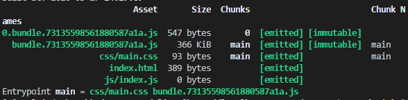

上章介绍了 webpack 基础篇，这章然我们继续深入;

<!--more-->

## 静态资源拷贝

如果我们在 index.html 中引入了本地的 js 文件，那么如何在打包的时候才能把它正确的引入进去呢？

```sh
|--public
|   |--index.html
|   |--js
|   |   |--index.js
|   |   |--other.js
```

那么这种情况，可以通过拷贝的形式放进打包目录，但是这是最不靠谱的方式，所以我们需要用到

```sh
npm install copy-webpack-plugin -D
```

webpack.config.js:

```js
new CopyWebpackPlugin(
  [
    {
      from: "public/js/*.js",
      to: path.resolve(__dirname, "dist", "js"),
      flatten: true
    }
  ],
  {
    ignore: ["other.js"]
  }
);
```

- flatten 设置为 true 是只拷贝文件，否则的话就连文件夹一起拷贝
- ignore 过滤掉不拷贝的文件

## ProvidePlugin 全局引入

作为 webpack 的内部插件，这个插件能帮助我们全局引入变量。

```js
new webpack.ProvidePlugin({
  identifier1: "module1",
  identifier2: ["module2", "property2"]
});
```

在 vue 或者 react 中我们不需要在每个组件中频繁的引入，所以可以这样

```js
new webpack.ProvidePlugin({
  React: "react",
  Component: ["react", "Component"], // 这种的默认导出为 module.exports
  Vue: ["vue/dist/vue.esm.js", "default"], // 这个地方加default，是因为默认导出的形式 export default
  $: "jquery",
  _map: ["lodash", "map"]
});
```

这样我们就可以在项目中使用 react, vue 这些变量了。

## 抽离 css

前面基础篇中打包实际上把 css 文件和在了 js 文件。实际开发中，css 文件也是非常大的。所以最好把他抽离出来。

所以这里我们需要用到

```sh
npm install mini-css-extract-plugin -D
```

接下来修改我们的配置文件

```js
const MiniCssExtractPlugin = require("mini-css-extract-plugin");
module.exports = {
  // loader 配置
  module: {
    rules: [
      {
        test: /\.css$/,
        use: [
          {
            loader: MiniCssExtractPlugin.loader,
            options: {
              hmr: isDev,
              reloadAll: true
            }
          },
          "css-loader",
          {
            loader: "postcss-loader",
            options: {
              plugins: function() {
                return [require("autoprefixer")()];
              }
            }
          }
        ]
      }
    ]
  },
  // 插件配置
  plugins: [
    new MiniCssExtractPlugin({
      filename: "css/[name].css",
      publicPath: "../" // 这里可以指定我们css存放的位置
    })
  ]
};
```

这里我们将浏览器的配置放到了.browserslistrc 文件中；

```
last 1 version
> 0.25%
```

通过打包我们就可以看到 css 的变化，如果没有变化，可以相应的将值调小一点，满足低版本的需求，> 0.1%

### 针对 css 进行压缩

在线上发布的时候，我们的资源是需要进行压缩的，有必要减少网络资源的消耗。我们来安装下面这个插件来完成这步操作。

```sh
npm install optimize-css-assets-webpack-plugin -D
```

修改我们的配置

```js
const OptimizeCssPlugin = require('optimize-css-assets-webpack-plugin');
module.exports =  {
  plugins: {
    new OptimizeCssPlugin()
  }
}
```

这样配置 js 和 css 文件都能够被压缩
再次打包的时候，你可以看到文件被压缩了。当我们在开发环境的时候，可以不用对此进行压缩。

## 按需加载

有时候我们的项目过于庞大的时候，所要加载的资源就会增多，这时候，我们就需要优化加载我们的加载资源 - 按需加载。我们可以通过 **@babel/preset-env** 来对我们的项目进行重新构建。起始在 vue/react, 加载路由的按需加载的机制也就是通过这样来实现的。

```js
import "./style/index.css";
// import Event from ('./event.js') 这样直接引入是不行的
document.getElementById("btn").onclick = () => {
  import("./event.js").then(fn => fn.default());
};
```

所生成的结构就入下面所显示

可以看到生成了两个 js 文件，可以去浏览器点击一下，就能只能知道实际效果了。
解释：

当 weabpck 遇到 import(\*\*\*),会重新进行处理

- 以**\*为入口重新生成一个 **Chunk\*\*

- 当代码执行到该语句的时候，才会加载 **Chunk** 所对应的文件

## 热更新

1. 首先在**devServer**中配置 hot 为 true,
2. 增加插件配置

```js
const webpack = require("webpack");

module.exports = {
  devServer: {
    port: "3000",
    compress: true,
    hot: true
  },
  plugins: [
    new webpack.HotModuleReplacementPlugin() //热更新插件
  ]
};
```

### 局部刷新

有时候我们修改代码的时候不需要则会个那个页面刷新，所以我们可以再次配置一下
webpack.config.js 文件

```js
if (module && module.hot) {
  module.hot.accept();
}
```

## 多应用打包

有些特殊的情况，我们的应用并不是一个单应用，而是一个多应用。那么对于多应用这种情况我们有如何进行打包呢？

1. 我们需要配置多个入口
2. 区别不同的输出文件
3. 配置多个 HtmlWebpackPlugin

然后对应配置**webpack.config.js**文件

```js
const HtmlWebpackPlugin = require("html-webpack-plugin");
module.exports = {
  entry: {
    index: "./src/index.js",
    login: "./src/login.js"
  },
  output: {
    path: path.resolve(__dirname, "dist"), //必须是绝对路径
    filename: "[name].[hash:6].js",
    publicPath: "/" //通常是CDN地址
  },
  plugins: [
    new HtmlWbapckPlugin({
      template: "./public/index.html",
      filename: "index.html"
    }),
    new HtmlWbapckPlugin({
      template: "./public/index.html",
      filename: "login.html"
    })
  ]
};
```

可以看到生成的目录结构

```
|-- index.b8f93f.js
|-- index.html
|-- login.b8f93f.js
|-- login.html
|-- css
|   |-- index.css
|-- js
    |-- index.js
```

如果我们打开 index.html, login.html 就会发现里面的内容的入口文件 js 被引用了两次。这时候我们可以在**HtmlWebpackPlugin**在配置**chunks**来指定所要引入的 js

```js
 new HtmlWbapckPlugin({
      template: "./public/index.html",
      filename: "login.html",
      chunks: ['login'], // 指定引入
      // excludeChunks: [] 排除引入
    }),
```

这样我们多应用配置就完成了。

## resolve 配置

**resolve**配置是告诉 webpack 去那些目录找到对应的文件，但是我们可以此设定定制我们的项目，接下来，走起...

### modules

**modules**是告诉我们去获取到解析的目录，那么有一种情况就很好使用，比如我们的组件经常用到，我们就可以从这个地方来定制引入就 ok，不用每次找文件引入。

```js
module.exports = {
  resolve: {
    modules: ["./src/components", "node_modules"]
  }
};
```

通过这样你引入的方式就简单了，比如说引入一个 Modal,

```js
import Modal from "Modal";
```

这样就能在 src/compoents 中找到对应的内容。

- modules 默认值是->node_modules

### alias

这个在 vue 应该用的比较多了，别名配置，通过此配置方便我们快速引入，而不需要相对位置或者绝对位置的干扰了

```js
module.exports = {
  resolve: {
    alias: {
      "@": path.resolve(__dirname, "src/")
    }
  }
};
```

ts 配置
配置之后在 tsconfig.json 中配置

```js
// ts下别名的检测
"baseUrl": "./src",
"paths": {
    "@/*": [
        "*"
    ]
}
```

### extensions

在引入文件的情况我们不想带上后缀，但是又得让系统能够识别，这个时候**extensions**就显得比较重要了。

```js
module.exports = {
  resolve: {
    extensions: [".ts", ".js"]
  }
};
````

这样在导入得文件时，就会自动給我加上后缀。

另一种用法，因为这个匹配得规则是从左到右，所以我们可以在多端适配的情况下使用这个

```js
module.exports = {
  resolve: {
    extensions: [".pc.js", ".mobile.js"]
  }
};
```

这样就可以引入 pc 或者 mobile 对应得文件，是不是美滋滋。

### enforceExtension

如果配置**enforceExtension**为 true 时，那么导入语句就不能缺损文件后缀。

### mainFields

这个字段可以指定加载包的对应文件，他的默认配置值为*['browser', 'main']*，这个值说明了，我们包在找到对应的文件首先去找 package.json 中的**browser**字段，然后在找到**main**字段。

在一些特定的包中，比如 bootstrap 中 package.json 是这样：

```js
{
    "style": "dist/css/bootstrap.css",
    "sass": "scss/bootstrap.scss",
    "main": "dist/js/bootstrap",
}
```

这样我们就可以重新配置**mainFields**:

```js
module.exports = {
  resolve: {
    mainFields: ["style", "main"]
  }
};
```

## 区分不同的环境

前面说到了通过 process.env.NODE_ENV 来进行环境设置，但是如果在开发调试的时候还是略显不方便。

数据脚手架的同学一定知道他的文件结构，那么我们也可以根据这样的文件结构来对项目模拟一波

- webpack.base.js: 工共模板
- webpack.dev.js: 开发环境
- webpack.prod.js:生产环境

那么如何将配置融合在一起呢？这里需要用到

```sh
npm install webpack-merge -D
```

```js
//webpack.config.dev.js
const merge = require("webpack-merge");
const baseWebpackConfig = require("./webpack.config.base");

module.exports = merge(baseWebpackConfig, {
  mode: "development"
  //...其它的一些配置
});
```

有点类似 Object.assin(), 后面的对象会覆盖前面的对象

在 package.json 中可以这样修改

```js
"scripts": {
  npx NODE_ENV=development webpack-dev-server --config=webpack.config.dev.js
}
```

也可以使用 merge.smart 合并， **merge.smart**在合并 loader 时，会将同一匹配规则进行合并。

## 定义环境变量

有些时候我们可能需要定义一些环境变量来对配置进行区分

webapck 可以通过 **DefinePlugin** 来定义环境变量

```js
const webpack = require("webpack");
module.exports = merge(baseWebpackConfig, {
  plugins: [
    new webpack.DefinePlugin({
      DEV: JSON.stringify("dev"), //字符串
      FLAG: "true" //FLAG 是个布尔类型
    })
  ]
});
```

然后通过下面就可以判断生产环境还是开发环境了

```js
if (DEV === "dev") {
  // dev
} else {
  // pro
}
```

## 解决跨域问题

在前端开发的时候，经常会遇到一个让人头疼的问题。跨域，这个问题，我们能在 webpack 中能得到很好的解决。
首先建立一个服务

```js
const Koa = require("koa");
const router = require("koa-router")();
const app = new Koa();

router.get("/api/info", (ctx, next) => {
  ctx.response.body = "you are good";
});

// 增加中间件
app.use(router.routes());
app.listen(4000);
console.log("app start at port: 4000");
```

然后新建一个 event.js 中去执行它

```js
const outputMsg = () => {
  console.log("发起请求");
  fetch("http://localhost:4000/api/info")
    .then(response => response.body)
    .then(data => console.log(data))
    .catch(err => console.log("err:", err));
};
```

这个时候如果直接访问就会出现跨域现象。

配置我们的代理

```js
 devServer: {
    port: "3000",
    compress: true,
    hot: true,
    proxy: {
      "/api": "http://localhost:4000"
    }
  },

 // 将原来的接口进行更换
 fetch("http://localhost:4000/api/info") =>  fetch("/api/info")
```

这样我们就能愉快的访问了。

当后端的请求类型不同 /user /list 可能是其他域名，没有 api，我们又改该如何操作呢？

```js
 proxy: {
      "/api": {
        target: "http://localhost:4000",
        pathRewrite:{
          '/api': ''
        }
      }
    }
```

## 模拟前端数据

前面我们实际上是启动了一个服务，才能请求。但是很多情况下，没有服务，又该怎么操作呢？这里我们可以用上**mock**

1. 安装 mock

```sh
npm install mocker-api -D
```

2. 新建 mock 文件夹，并建立 mocker.js 文件

```js
module.exports = {
  "GET /api/info": { name: "you you you" },
  "POST /login": (req, res) => {
    return res.send({
      status: "ok",
      code: 0,
      data: { id: 1, sex: "1" }
    });
  }
};
```

3. 修改 webpack.dev.js

```js
const path = require("path");
const merge = require("webpack-merge");
const webpack = require("webpack");
const baseWebpackConfig = require("./webpack.config.base");
const apiMocker = require("mocker-api");
module.exports = merge(baseWebpackConfig, {
  devServer: {
    before(app) {
      apiMocker(app, path.resolve("./mock/mocker.js"));
    }
  }
});
```

重新启动服务，可以看看是不是成功了。

至此，进阶篇章就完成了。
