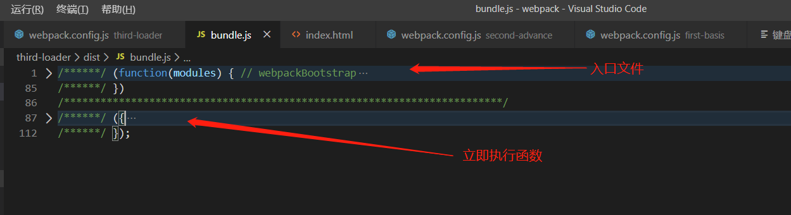
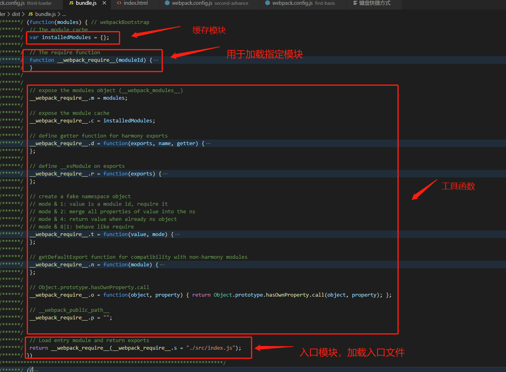
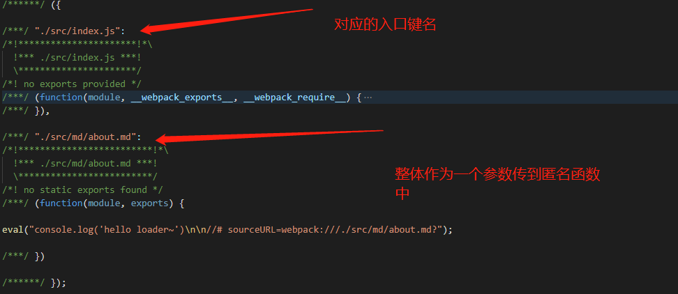

webpack 作为前端工具的重要一环，在webapck4中已经极大的简化了开发者的运营成功，但是对于webpack更加深入的了解；现在让我们一起来从底层来解读webpack.
<!--more-->

## 运行机制与核心工作原理

### 项目的的整体结构

首先这里我们配置一个简单的**webpack.config.js**; 
```ts

// import { Configuration } from 'webpack'
const HtmlWbapckPlugin = require("html-webpack-plugin");
const { CleanWebpackPlugin } = require("clean-webpack-plugin");
/**
 * @type {Configuration}
 */
module.exports = {
    mode: 'development',
    entry: './src/index.js',
    output: {
        filename: 'bundle.js'
    },
    plugins: [
        new HtmlWbapckPlugin({
            template: './public/index.html',
            filename: 'index.html'
        }),
        new CleanWebpackPlugin()
    ]
}
```
接下来我们执行 
```ts
npx webpack
```
我们对打包后的文件进行拆解分析

打包后生成一个自执行函数,我们来看一下这个自执行函数


首先分析入口函数，它几首一个modules参数，调用的时候传入一个数组，我们可以看到传入进来的是一个对象。

然后再return中会找到我们对应的入口文件解析，开始webpack的工作。


### loader 运行机制
这里我们创建一个**markdown-loader.js**的文件，然后再module中引入
```js 
// webpackconfig.js
module: {
    rules: [
        {
            test: /\.md$/,
            use: './markdown-loader'
        }
    ]
}
```

```js
// markdown-loader.js
module.exports = source => {
    console.log(source)

    return "console.log('hello loader~')"
}
```
当匹配到到文件后缀名为**.md**的时候就会进入这个js文件，那为什么我需要返回一个js 格式的字符串呢？

这是因为webpack内部默认只能够处理JS模块代码，说白了，就是它默认把所有的文件都当成js代码来解析了。当然我们可以**从后往前**进行处理多个loader,最后到达**webpack** 输出打包文件


有一个比较有意思的地方，用过webpack都知道，加载css的时候需要加载**css-loader**,而且还需要加载**style-loader**

 为什么要加载两个呢？可以阅读打包后的源码得知。
1. css-loader 只会把 CSS 模块加载到 JS 代码中，而并不会使用这
2. style-loader 会调用响应生成得css内容

### plugin 运行机制

webpack 相比loader的管道机制，plugin的作用或许来说更大，那么它是如何来实现的呢？

总结一句来说**weabpack插件开发机制就是钩子机制**


接下来开发一个自己的plugin

1. 插件是由「具有 apply 方法的 prototype 对象」所实例化出来的。这个 apply 方法在安装插件时，会被 webpack compiler 调用一次
2. 即插件要求必须是一个函数或者对象，且包含有apply方法
3. 找到对应的钩子, comile=> 编译器 run=>运行期 emit => 输出文件执行
4. tap 事件触发同步机制， tapAsync 触发异步机制 [具体查看](https://www.webpackjs.com/api/plugins/)
5. 必须将生成的文件的内容，和大小返回给webpack

```js
class RemoveCommentsPlugin {
    apply(compiler) {
        console.log('Remove comments')

        compiler.hooks.emit.tap('RemoveCommentsPlugin', compilation => {
            // compilation 可以视为此次打包的上下文
            for (const name in compilation.assets) {
                // console.log(compilation.assets[name].source())
                if (name.endsWith('.js')) {
                    const contents = compilation.assets[name].source();
                    const noComments = contents.replace(/\/\*{2,}\/\s?/g, '')
                    compilation.assets[name] = {
                        source: () => noComments,
                        size: () => noComments.length
                    }
                    console.log('你需要操作的文件:', name)
                }
            }
        })

    }
}

module.exports = RemoveCommentsPlugin
```
**钩子机制**即面向切切面编程
