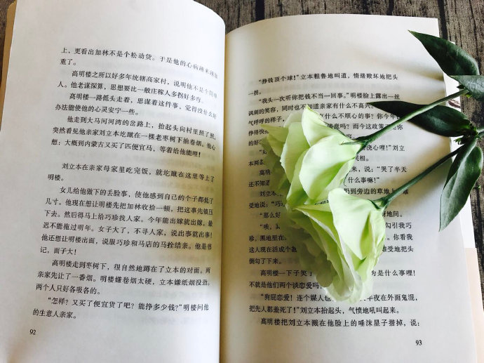

最近读了路遥老师的「人生」一本书，读完之后也想把自己的一些想法给抒发出来。

<!--more-->

对我影响最大的人是路遥，18岁时高考失利，应聘五六个工作岗位没人要，只能去当送杂志的零工，是《人生》改变了我，让我意识到不放弃总有机会，否则我还还在踩三轮车

 ——马云

对待社会，我们常说要向前看，对一个人来说，也要向前看。生活总是这样，不能叫人相处得满意。但我们还要热情的活下去。人活一生，值得爱的东西有很多，不要因为一个方面不满意，就灰心。

——路遥

### 时代

我们所处的时代毕竟不同，很多事情不能以现在的观点去对以前的事物评头论脚。每个时代的人物或多或少都有着自己对于的未来不同的看法。但是，不管如何，我们所努力的都是让自己变得更好。一个人从出生到现在，所追求的根本是什么呢？我觉得有以下几种可能，被尊重，被敬仰，享受更好的生活，不甘平庸，做自己喜欢的事。绝大部分人从出生到达人生的制高点不可能一帆风顺，总会有很多磨难。

人生中主人公，在面对命运的时候，可以说至始至终都没有妥协，不甘于自己的才能就此被埋没。当然这一路上，有光明也有黑暗的，但是这些东西，在一个人成长的过程中很大程度上都会沾上。以前亦或是现在的社会都不可能给你一条光明的康庄大道给你走，但也不能说，黑色的路你就一直走下去，而是在于你心中的度量，生活才会变得更加丰满。有一句话叫“出淤泥而不染”这里说的荷花能够如此绚丽绽放，是因为它理解了淤泥，它的底蕴与淤泥而起（仅仅是我的另外的解读）。不要甘于被命运所打败，不要让生活左右你，记住自己的初心，向着自己的目标走去。

### 感情

感情这事，难道真要“忠贞不渝”那样的爱情才叫绚烂吗？感情这事我觉得主要是两个人的价值取向，以及共同话题。在选择自己情感的问题上，更多的是让自己感到能为此付出。以前和现在对于感情的事的态度可以说事两种态度，现在开放了，但是确实让人的选择更加迷茫了，物质上的基础，各种交错的新鲜事物，更加使人们感到困惑，同时也在缩小你的选择范围。总而言之，选择还是在自己，但是想要让自己拥有更多的选择权，无疑是自己内在的价值。

### 选择

一个人的选择是很重要的，这确实是让我们能够谨慎去对待的；选择了一件事就需要对此负责，如果承担选择的后果是去逃避，那么你无疑是失败的，既然做出了选择，就努力去实现他，人生很难有回头路，也很难有后悔药。

希望未来不要感叹 ”曾经沧海难为水，除却巫山不是云“