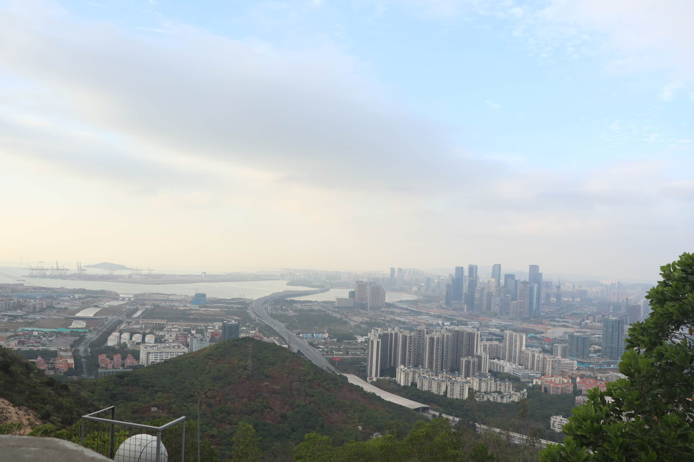

2020的生活已经开始。从新出发，让自己在新的一年里不要留下遗憾，始终坚定的走自己路线。

<!-- more -->

这大概是我今年看过时长最长的一部电影了，全篇影片时长近3个小时，但是在我观影的过程中我觉得并不让我乏味，反而让我食髓知味。

我对一部电影的评价不是去评价它的整个过程发生了什么，剧情如何。而是它能给我带去什么，上个世纪，也就是我父母那一辈，他们希望通过辛勤的工作，
为人的朴实，来为自己以及家人带去更好的生活。那个年代所呈现出来感情，我觉得很质朴，就像白雪一样，没有过多杂志。对人亦或是对事都一样。当然每个人的
境遇都不同，但不变的还是老一辈人对于情感的那种纯真。影片中的主角，在自己最美好的年龄，失去了自己的儿子，没有选择对待那个伤害自己儿子的人（他的挚友）做出过激的行为
，而是选择了隐忍，在这种极度伤感的情绪下离开了自己所在的地方，这个让自己温暖也让自己难受的地方。几经浮尘，自己的生活也变得不是那么令人欢喜，人似乎也失去了活下去的动力，
只有相互扶持的坚持。

生活尚且艰难，还得苟且而活。人在一生的过程中不能够被所谓的“挫折”所打倒，我们得坚持自己得人生路线，对于自己得人生得有明确得规划，人不能活在悔恨中，对于自己的计划就要坚定
不移得去执行，生活如此，亦或是对于，保持自己的初心，不要被其他的诱惑所移动。尽管在这个过程中会让你很难受，难受到想哭，但是生活本就是如此，没有多少美丽可言，人的一生，对于
自己来说，贵在坚持，做什么事情都是一样，不能没有目的，不能没有动力。

今天去爬了下南山，感觉对于最近的生活有了一个很好的放松，人对于事情是需要对角度去看待的，对于工作，要尽心尽责。当然在生活的过程中，请记住，生活不是仅仅只有工作，要多去从不同的
角度体会生活。过上一个让自己满意的人生。人的一生中有很多美好的东西，这些东西，你不去接触它，就永远也不了解。在生活中，需要做到的是，对于别人的需要，尽可能的去帮助，人啊，不要
怕去面对，面对一件事情，最糟糕的是在你不敢去正式它，如何你能好好的正式，那这些东西又怎么能难到你呢？这次爬山也算是为了于去年进行了对比，去年的目标确实算基本完成，但是呢？我对于
子的生活确并不满意，我的人生不应该这样，我需要做到的事是把事情做好，让自己的人生不留遗憾，很多我制定的针对自己的方案，没有很好去实现。我希望自己的人生能如自己的想法走，我知道，这需要
很多的努力才能去完成。不要松懈，一旦你松懈，你的生活被打乱，那么迎接你的将是一个更加难得人生。

2020年的生活已经开始，不要迷茫，坚定贯彻自己的行动方针，生活的确很艰难，但是我们也不能停止了前进的动力。我不需要自己去适应环境，我需要的是让自己站在一个更高的高度去审视自己
，让自己能更加从容的应对生活。2020年，我想对自己说，坚持就是胜利，对于自己制定得方案，要矢志不移得去完成，不要为自己找任何借口，理由。